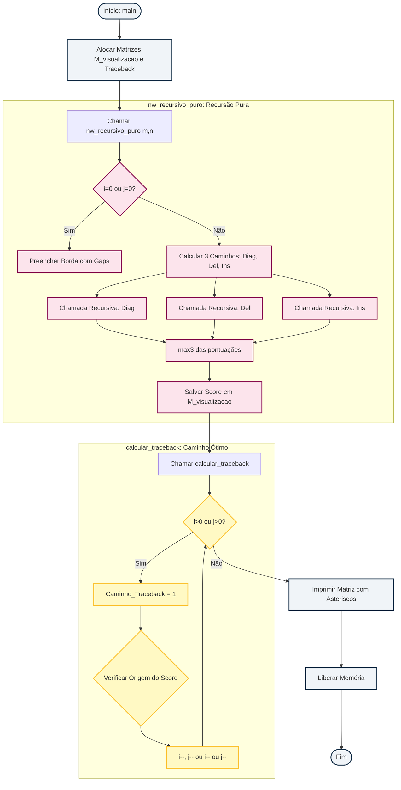
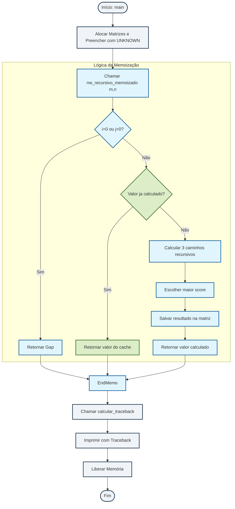
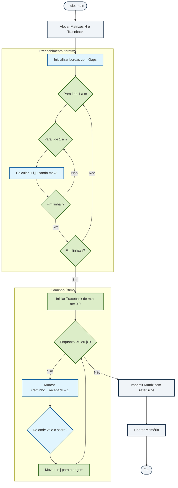

```mermaid
graph TD
    %% Estilos
    classDef main fill:#f0f4f8,stroke:#102a43,stroke-width:2px;
    classDef rec fill:#fce4ec,stroke:#880e4f,stroke-width:2px;
    classDef trace fill:#fff9c4,stroke:#fbc02d,stroke-width:2px;

    %% Fluxo Principal
    Start([Início: main]) --> Alloc[Alocar Matrizes M_visualizacao e Traceback]
    Alloc --> CallRec[Chamar nw_recursivo_puro m,n]

    subgraph Recursao [nw_recursivo_puro: Recursão Pura]
        CallRec --> Base{i=0 ou j=0?}
        Base -- Sim --> Borda[Preencher Borda com Gaps]
        Base -- Não --> Branch[Calcular 3 Caminhos: Diag, Del, Ins]
        Branch --> Rec1[Chamada Recursiva: Diag]
        Branch --> Rec2[Chamada Recursiva: Del]
        Branch --> Rec3[Chamada Recursiva: Ins]
        Rec1 --> Max[max3 das pontuações]
        Rec2 --> Max
        Rec3 --> Max
        Max --> Save[Salvar Score em M_visualizacao]
    end

    Save --> CallTrace[Chamar calcular_traceback]

    subgraph Traceback [calcular_traceback: Caminho Ótimo]
        CallTrace --> While{i>0 ou j>0?}
        While -- Sim --> Mark[Caminho_Traceback = 1]
        Mark --> Check{Verificar Origem do Score}
        Check --> Move[i--, j-- ou i-- ou j--]
        Move --> While
    end

    While -- Não --> Print[Imprimir Matriz com Asteriscos]
    Print --> Free[Liberar Memória]
    Free --> End([Fim])

    %% Aplicando Estilos
    class Start,Alloc,Print,Free,End main;
    class Base,Borda,Branch,Rec1,Rec2,Rec3,Max,Save rec;
    class While,Mark,Check,Move trace;

```

```mermaid

graph TD
    %% Estilos
    classDef main fill:#f0f4f8,stroke:#102a43,stroke-width:2px;
    classDef memo fill:#e1f5fe,stroke:#01579b,stroke-width:2px;
    classDef cache fill:#dcedc8,stroke:#33691e,stroke-width:2px;

    Start([Início: main]) --> Init[Alocar Matrizes e Preencher com UNKNOWN]
    Init --> CallMemo[Chamar nw_recursivo_memoizado m,n]

    subgraph Memoizacao [Lógica da Memoização]
        CallMemo --> Base{i=0 ou j=0?}
        Base -- Sim --> RetBase[Retornar Gap]
        Base -- Não --> CheckCache{Valor ja calculado?}

        %% Caminho do Cache
        CheckCache -- Sim --> RetCache[Retornar valor do cache]

        %% Caminho do Cálculo
        CheckCache -- Não --> Calc[Calcular 3 caminhos recursivos]
        Calc --> Max[Escolher maior score]
        Max --> Store[Salvar resultado na matriz]
        Store --> RetCalc[Retornar valor calculado]
    end

    RetBase --> EndMemo
    RetCache --> EndMemo
    RetCalc --> EndMemo

    EndMemo --> CallTrace[Chamar calcular_traceback]
    CallTrace --> Print[Imprimir com Traceback]
    Print --> Free[Liberar Memória]
    Free --> Final([Fim])

    %% Aplicando Estilos
    class Start,Init,CallTrace,Print,Free,Final main;
    class CallMemo,Base,RetBase,Calc,Max,Store,RetCalc,EndMemo memo;
    class CheckCache,RetCache cache;

```

```mermaid
graph TD
    %% Estilos
    classDef main fill:#f0f4f8,stroke:#102a43,stroke-width:2px;
    classDef loop fill:#dcedc8,stroke:#33691e,stroke-width:2px;
    classDef calc fill:#e1f5fe,stroke:#01579b,stroke-width:2px;

    Start([Início: main]) --> Alloc[Alocar Matrizes H e Traceback]
    Alloc --> InitBorders[Inicializar bordas com Gaps]

    subgraph Iteracao [Preenchimento Iterativo]
        InitBorders --> ForI{Para i de 1 a m}
        ForI --> ForJ{Para j de 1 a n}
        ForJ --> Calc[Calcular H i,j usando max3]
        Calc --> ForJ_Inc{Fim linha j?}
        ForJ_Inc -- Não --> ForJ
        ForJ_Inc -- Sim --> ForI_Inc{Fim linhas i?}
        ForI_Inc -- Não --> ForI
    end

    ForI_Inc -- Sim --> Trace[Iniciar Traceback de m,n até 0,0]

    subgraph Reconstrucao [Caminho Ótimo]
        Trace --> While{Enquanto i>0 ou j>0}
        While -- Sim --> Mark[Marcar Caminho_Traceback = 1]
        Mark --> Decide{De onde veio o score?}
        Decide --> Move[Mover i e j para a origem]
        Move --> While
    end

    While -- Não --> Print[Imprimir Matriz com Asteriscos]
    Print --> Free[Liberar Memória]
    Free --> Final([Fim])

    %% Aplicando Estilos
    class Start,Alloc,Print,Free,Final main;
    class ForI,ForJ,ForI_Inc,ForJ_Inc,Trace,While,Move loop;
    class InitBorders,Calc,Mark,Decide calc;

```
